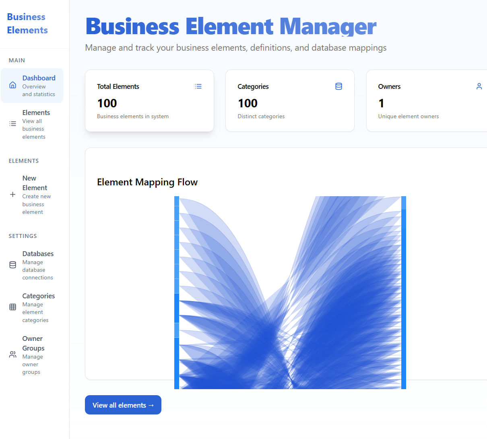

# Business Element Manager

A comprehensive system for tracking, validating, and visualizing complex database mappings and business element relationships. This application helps organizations manage and maintain their business elements, data quality rules, and database mappings in a centralized location.

## Features

- 📊 Interactive Sankey chart for mapping visualization
- 📝 Comprehensive business element tracking
- ✅ Data quality rule implementation and management
- 🔄 Multi-database support
- 🏢 Detailed category and owner group integration
- 📈 Version history tracking

## Application Screenshot

*Main dashboard showing business element statistics and Sankey diagram*

## Prerequisites

Before you begin, ensure your Linux server has the following:

- Node.js 20.x or later
- PostgreSQL 15.x or later
- Git
- A system user with sudo privileges

## Installation Guide

### 1. System Preparation